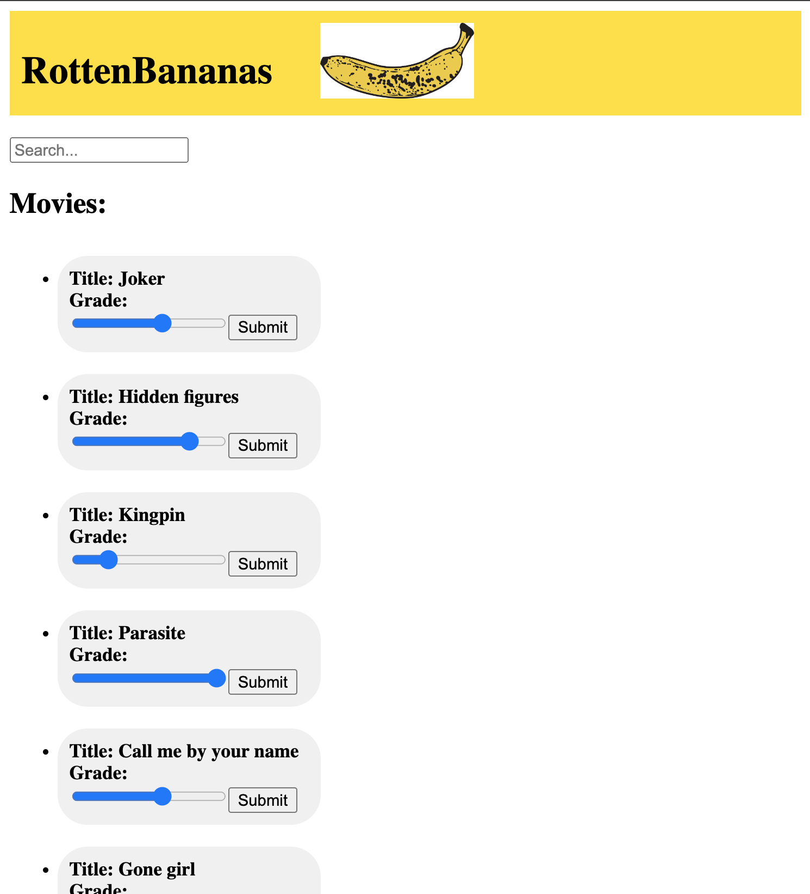

Karin's Storykit Test: rottenBananas
=====

This is an application where you can search for movies in the database and edit the grade of them. I have never used angular before, so I chose this assignment to try it out. If it's a catastrophe you'll notice.

Notes:
* The components (except for app) are MoviesComponent and SearchBoxComponent. Both of them
are served by MoviesService.
* The html templates would be separate files in most projects, but they are kept in the
ts-files to simplify getting a good overview.
* I used only a mockup lightweight database that is HTTP-requested from MoviesService. Normally
database handling and data filtering would happen backend, but for this exercise I considered
it more apt to keep it simple.

Feature set:
* Search for movies in the database.
* Edit the grade (from 1 to 5) of a movie and have it updated in the database.


## Getting started

With json-server in one terminal from rottenBananas/src/app repository:
```
json-server --watch db.json
```
and Node.js and angular-cli from rottenBananas repository:
```
ng serve
```
go to http://localhost:4200/ for the application
and http://localhost:3000/videos for the database


