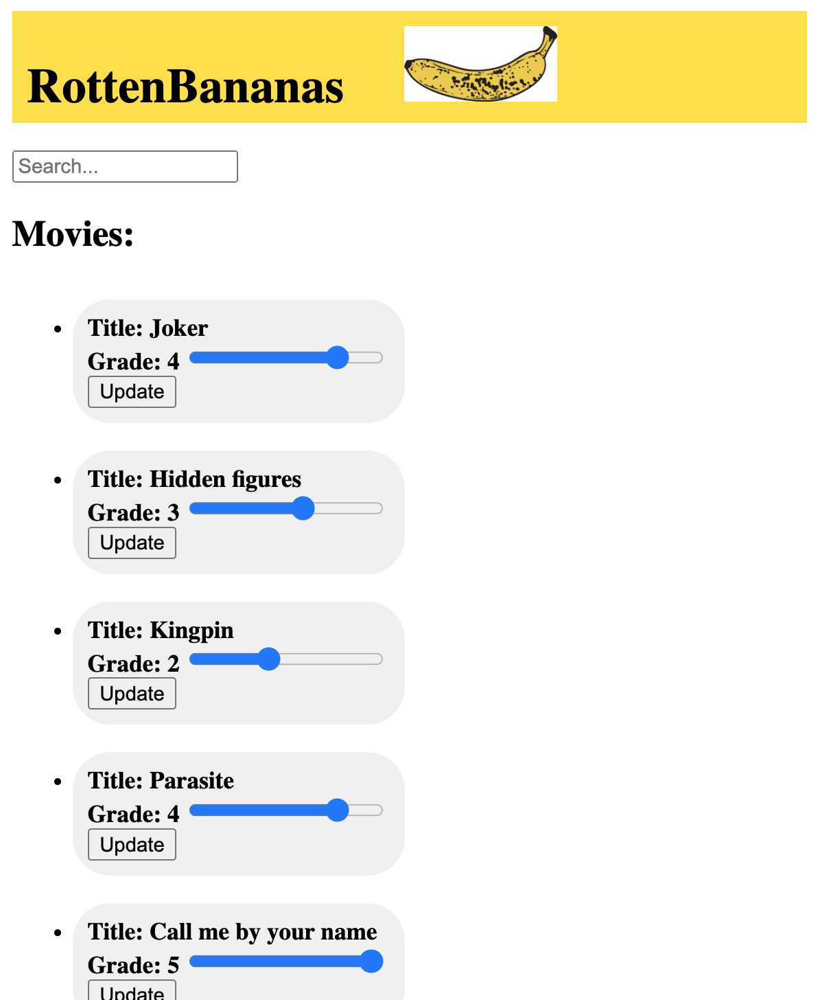

Karin's Storykit Test: rottenBananas
=====

This is an application where you can search for movies in the database and edit the grade of them.
I have never used angular before, so I chose this assignment to try it out. If it's a catastrophe you'll notice.

Feature set:
* Search for movies in the database.
* Edit the grade (from 1 to 5) of a movie and have it updated in the database.


## Getting started

With Node.js and angular-cli from rottenBananas repository:
```
ng serve
```
and json-server:
```
json-server --watch db.json
```
go to http://localhost:4200/ for the application
and http://localhost:3000/videos for the database


